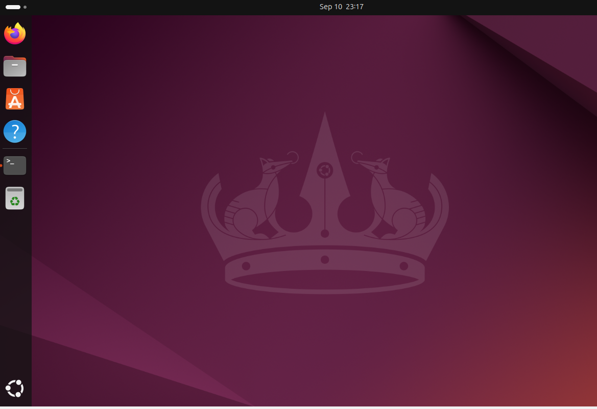
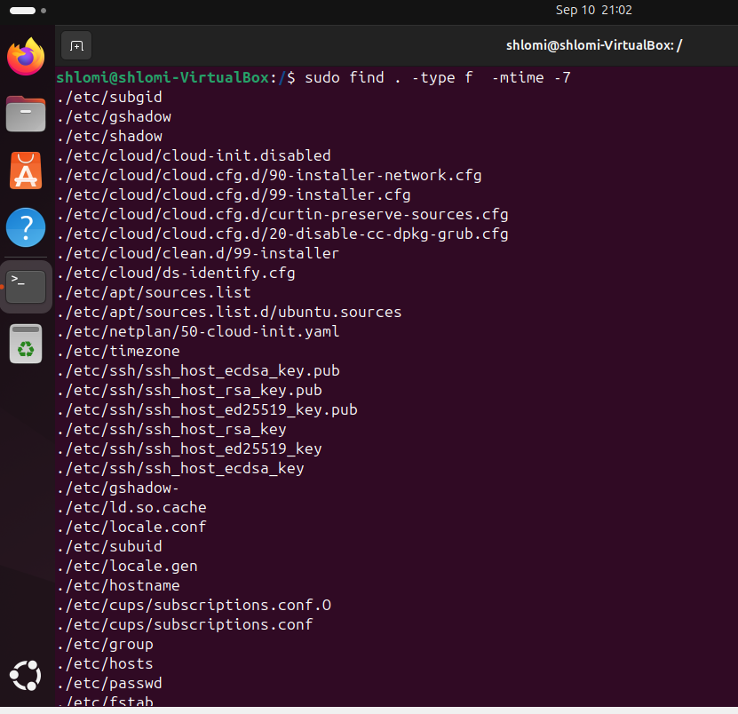

# Dex2HomeWork1
Repository for the firs home work on Dex2.0 course

## Part1: installation

## Par2: Linux directory and filecreation
  - Create directory structure:
    
    
  - Add content to file:
    
    
    

## part 3: Using grep and find command
  - grep command:  
    
  - find command:  
    
  - find files modified within the last 7 days:  
    
    
